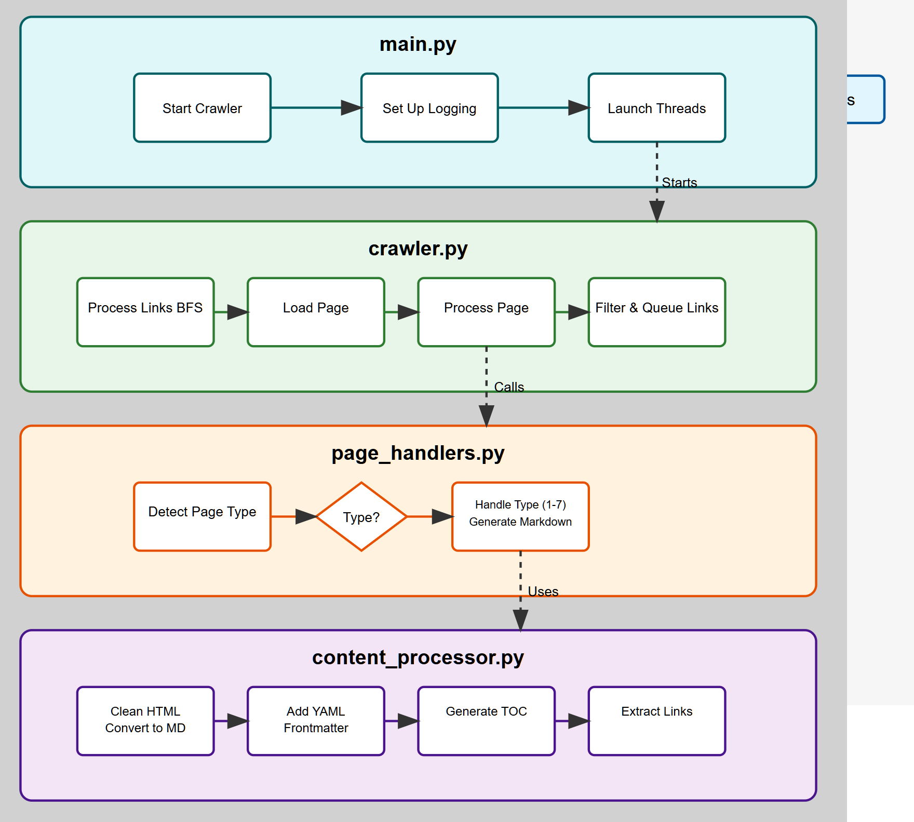
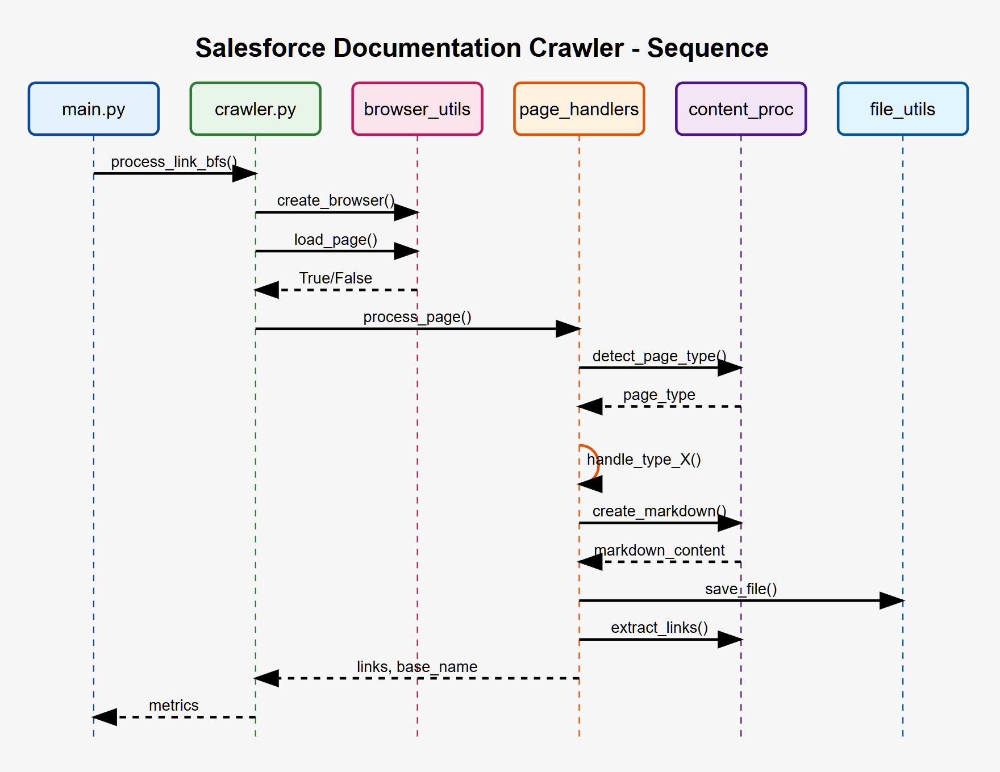

# Salesforce Documentation Crawler

A multithreaded documentation crawler designed to build a high-quality, offline-ready markdown dataset for retrieval-augmented generation (RAG) systems like LangChain.

## Overview

This crawler is specifically optimized for Salesforce and MuleSoft documentation, but is extensible to other documentation sources. It includes support for various page types including standard help articles, Apex help pages, and Trailhead learning content.

The crawler performs a breadth-first search on documentation pages, processes the content, and converts it to markdown format with YAML frontmatter containing useful metadata. The output is structured in a way that makes it ideal for RAG applications.

## Features

- **Multithreaded crawling**: Efficiently processes multiple products in parallel
- **Intelligent page type detection**: Specialized handling for 7 different document types
- **Clean markdown conversion**: Produces high-quality markdown with YAML frontmatter
- **Comprehensive metrics**: Tracks crawl performance and generates detailed logs
- **Customizable depth and limits**: Configure how deep to crawl and how many pages to process
- **Robust error handling**: Gracefully handles network issues and malformed pages

## Requirements

- Python 3.8+
- Chrome browser (for Selenium WebDriver)
- Dependencies listed in `requirements.txt`

## Installation

1. Clone this repository:
```bash
git clone https://github.com/yourusername/salesforce-documentation-crawler.git
cd salesforce-documentation-crawler
```

2. Install dependencies:
```bash
pip install -r requirements.txt
```

## Configuration

The crawler's behavior is configured in `config.py`. Key settings include:

- `BASE_OUTPUT_FOLDER`: Where to store markdown files
- `MAX_LINK_LEVEL`: Maximum depth to crawl
- `MAX_PAGES_PER_PRODUCT`: Maximum pages to process per product
- `PRODUCT_URL_PREFIXES`: URL patterns to categorize content by product
- `ALLOWED_DOMAINS`: Domains the crawler is allowed to visit

Starting URLs are defined in `start_links.json`.

## Usage

To run the crawler with default settings:

```bash
python main.py
```

This will:
1. Create a `RAG_Collection` directory (or the directory specified in `BASE_OUTPUT_FOLDER`)
2. Start crawling from URLs defined in `start_links.json`
3. Process pages up to the configured depth limit
4. Generate markdown files organized by product
5. Create summary logs with metrics

### Example Output Structure

```
RAG_Collection/
├── Sales_Cloud/
│   ├── output_help.salesforce.com_s_articleView_id_sales.sales_get_started.htm_type_5.md
│   ├── output_help.salesforce.com_s_articleView_id_sales.sales_core.htm_type_5.md
│   └── ...
├── Service_Cloud/
│   ├── output_help.salesforce.com_s_articleView_id_service.service_cloud.htm_type_5.md
│   └── ...
├── MuleSoft/
│   ├── output_help.mulesoft.com_s_article_Network_connectivity_testing.md
│   └── ...
├── scraper.log
├── summary.log
└── skipped_404.log
```

### Markdown Output Format

Each output file includes:
- YAML frontmatter with metadata
- Auto-generated table of contents
- Cleaned and formatted markdown content

Example:
```markdown
---
title: "Getting Started with Sales Cloud"
date: "2023-09-15"
tag: "Sales_Cloud"
category: "Product Documentation: Sales_Cloud"
toc: true
depth_level: 0
source_url: "https://help.salesforce.com/s/articleView?id=sales.sales_get_started.htm&type=5"
---

## Table of Contents

- [Introduction](#introduction)
- [Key Features](#key-features)
  - [Account Management](#account-management)
  - [Contact Management](#contact-management)
- [Getting Started](#getting-started)

# Introduction

Sales Cloud is a customer relationship management (CRM) platform...
```

## Architecture

The crawler is organized into several Python modules:

- `main.py`: Main entry point and thread coordination
- `crawler.py`: Core crawling logic using breadth-first search
- `browser_utils.py`: Browser interaction utilities
- `content_processor.py`: HTML cleaning and markdown conversion
- `page_handlers.py`: Specialized handlers for different page types
- `file_utils.py`: File and path operations
- `logger.py`: Logging configuration and summary generation
- `config.py`: Configuration settings

### Architecture Diagrams

#### Flow Diagram


This diagram shows the major components of the crawler and how they interact.

#### Sequence Diagram


This sequence diagram illustrates the typical flow of a crawl operation from initialization to completion.

## Extending the Crawler

### Adding New Product Categories

To add a new product category, update `PRODUCT_URL_PREFIXES` in `config.py` and add starting URLs to `start_links.json`.

### Supporting New Page Types

To support a new page type:
1. Add a new type detector in `detect_page_type()` in `content_processor.py`
2. Implement a new handler function in `page_handlers.py`
3. Update the `process_page()` function to use your new handler

