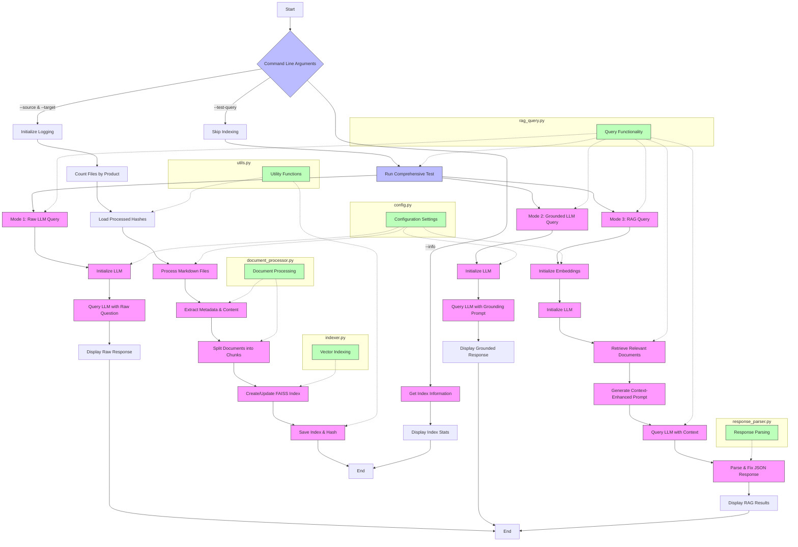
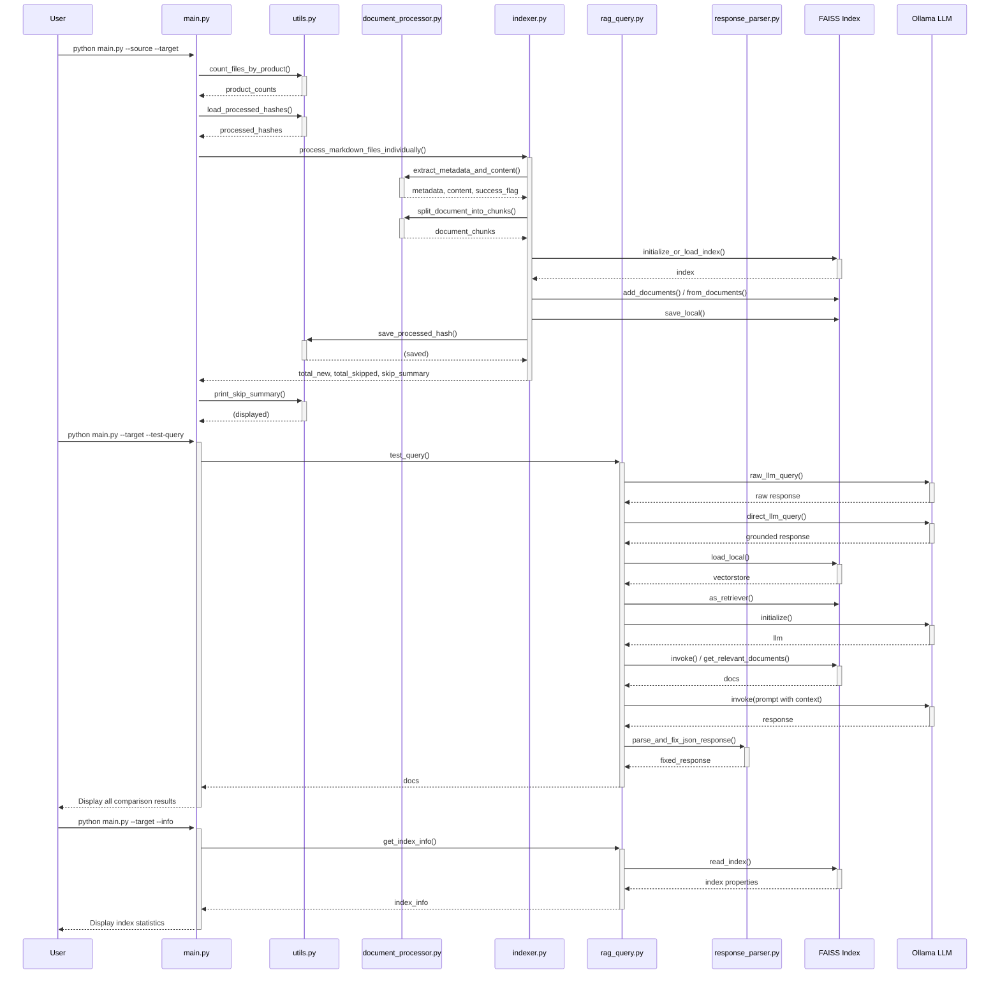

# RAG System

A Retrieval-Augmented Generation (RAG) system for processing and querying Markdown documents with YAML frontmatter.

## Overview

This system processes Markdown files, extracts content and metadata, splits documents into chunks, and creates vector embeddings stored in a FAISS index. The index can then be queried to retrieve relevant document chunks for generating responses using an Ollama LLM.

## Architecture Diagrams

### Flow Diagram
This diagram illustrates the overall structure and flow of the RAG system, showing how different components interact and the main execution paths.



### Sequence Diagram
This diagram shows the temporal sequence of interactions between the different components of the system, highlighting how data flows between modules during execution.



You can download the diagrams as SVG files:
- [Flow Diagram (SVG)](images/flow-diagram.svg)
- [Sequence Diagram (SVG)](images/sequence-diagram.svg)

## Features

- **Incremental Processing**: Only processes new or changed files using content hashing
- **Progress Tracking**: Provides detailed progress information with time estimates
- **Error Handling**: Tracks and summarizes skipped files and processing errors
- **Document Splitting**: Splits documents at markdown headers for better context handling
- **Vector Embedding**: Uses HuggingFace embeddings for semantic search
- **Comprehensive Testing**: Tests queries with three modes - raw LLM, grounded LLM, and RAG
- **GPU Acceleration**: Automatically detects and utilizes GPU for faster processing
- **Compliance Categorization**: Classifies responses as Fully Compliant (FC), Partially Compliant (PC), Not Compliant (NC), or Not Applicable (NA)

## Files Structure

- **main.py**: Main script and entry point
- **config.py**: Configuration settings and constants
- **utils.py**: Utility functions for file handling, hashing, and progress tracking
- **document_processor.py**: Document loading, parsing, and splitting functionality
- **indexer.py**: Vector embedding and FAISS index management
- **rag_query.py**: Query functionality for testing the RAG system
- **response_parser.py**: Ensures responses follow the expected JSON format

## Requirements

- Python 3.8+
- Dependencies (install via `pip install -r requirements.txt`)

## Installation

1. Clone the repository:
```bash
git clone https://github.com/yourusername/rag-system.git
cd rag-system
```

2. Install dependencies:
```bash
pip install -r requirements.txt
```

3. Install Ollama and run it locally (required for LLM):
```bash
# Visit https://ollama.com/download for installation instructions
ollama serve  # Start the Ollama server
ollama pull gemma3:12b  # Pull the default model
```

## Usage

### Building the Index

```bash
python main.py --source /path/to/markdown/files --target /path/to/faiss/index
```

### Testing with Comprehensive Query Comparison

Run a comprehensive test that compares three different query modes:
1. Raw LLM (no grounding, no RAG)
2. Grounded LLM (with grounding, no RAG)
3. RAG-enhanced LLM (with grounding and document context)

```bash
python main.py --target /path/to/faiss/index --skip-indexing --test-query --question "Your question here"
```

### Getting Information About an Index

```bash
python main.py --target /path/to/faiss/index --info
```

## Example Output

When running a comprehensive test query:

```bash
python main.py --target ./faiss_index --skip-indexing --test-query --question "Describe the Order Management functionality in your solution."
```

Output:
```
🧠 Starting RAG system...
💾 FAISS index location: ./faiss_index
⏭️ Skipping indexing phase as requested...

🔍 Running comprehensive test query with all three modes:
  1. Raw LLM (no grounding, no RAG)
  2. Grounded LLM (with grounding, no RAG)
  3. RAG-enhanced LLM (with grounding and document context)

📝 Querying LLM with no grounding or RAG (raw query)

========================================
Question: Describe the Order Management functionality in your solution.
Raw LLM Answer (NO GROUNDING, NO RAG): Salesforce Order Management provides a comprehensive solution for managing the entire order lifecycle, from capture to fulfillment. It allows businesses to create a unified commerce experience across channels by centralizing order processing.

Key capabilities include:

1. Omnichannel order management: Capture orders from any channel (online, in-store, mobile, etc.) and manage them in a single system.

2. Order orchestration: Automate complex fulfillment processes with configurable workflows.

3. Distributed inventory management: Gain real-time visibility into inventory across locations and intelligently route orders based on inventory availability.

4. Flexible fulfillment options: Support various fulfillment methods including ship-from-store, buy-online-pickup-in-store (BOPIS), and drop shipping.

5. Order modification and service: Handle cancellations, returns, exchanges, and customer service inquiries directly within the system.

6. Payment processing: Manage payments, refunds, and split payments across multiple methods.

7. Integration capabilities: Connect with other Salesforce products like Commerce Cloud and Service Cloud, as well as external systems through APIs.

8. Analytics and reporting: Access detailed insights into order and fulfillment performance.

Salesforce Order Management is designed to be highly configurable to meet specific business requirements while maintaining the flexibility to adapt to changing customer expectations and business models.
========================================

📝 Querying LLM with grounding but without RAG (no context provided)

========================================
Question: Describe the Order Management functionality in your solution.
Grounded LLM Answer (NO RAG): {
  "compliance": "FC",
  "answer": "Salesforce Order Management provides a comprehensive solution for the entire order lifecycle. It enables businesses to capture, process, fulfill, and service orders across all channels in a unified system. The solution includes capabilities for inventory visibility, order routing, payment processing, tax calculation, shipping integration, and returns management. Users can configure complex order workflows through a visual interface without coding, including approval processes and exception handling. The system provides real-time order status tracking and supports multiple fulfillment models including ship-from-store, buy-online-pickup-in-store, and drop-shipping. It integrates seamlessly with Salesforce Commerce Cloud for digital storefronts and Service Cloud for customer service, while also connecting to external systems through pre-built connectors and APIs."
}
========================================

📝 Running RAG-enhanced query (with grounding and document context)
🚀 Using GPU acceleration for vector search (GPUs: 2)

========================================
Question: Describe the Order Management functionality in your solution.
RAG-Enhanced Answer: {
  "compliance": "FC",
  "answer": "Salesforce Order Management is a robust solution that enables businesses to manage their order fulfillment processes end-to-end. The system provides comprehensive lifecycle management from order capture through fulfillment, invoicing, and returns. Key capabilities include product bundling and configuration, allowing businesses to create complex product offerings with multiple components and pricing rules. The system supports sophisticated order routing and orchestration based on inventory availability, geographical proximity, and fulfillment capacity. Salesforce Order Management seamlessly integrates with inventory systems to provide real-time stock visibility and enables distributed order management across multiple locations. The solution includes powerful order modification capabilities where orders can be amended, canceled, or returned based on configurable business rules, even after the point of no return (PONR). Additionally, it provides extensive options for payment processing, tax calculation, and pricing adjustments through the native Commerce Cloud integration or third-party connectors."
}
========================================
```

## Performance Optimization

For optimal performance with large indices, it's highly recommended to use the GPU-accelerated version of FAISS:

```bash
pip uninstall faiss-cpu
pip install faiss-gpu
```

The system will automatically detect if a GPU is available and display recommendations accordingly.

## Customization

You can customize the system by modifying the configuration in `config.py`:

- Change embedding or LLM models
- Adjust directory paths
- Update logging format
