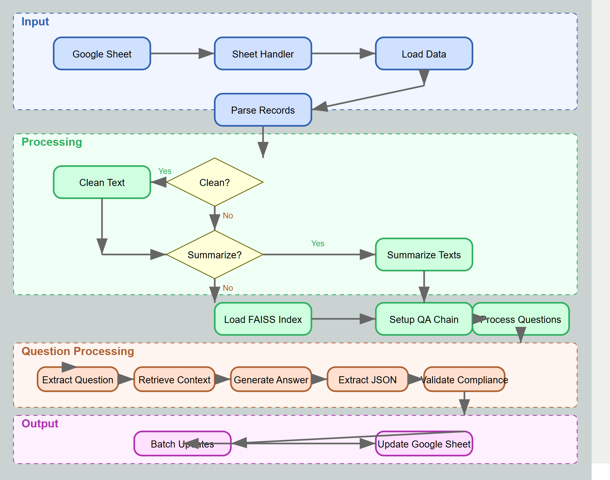
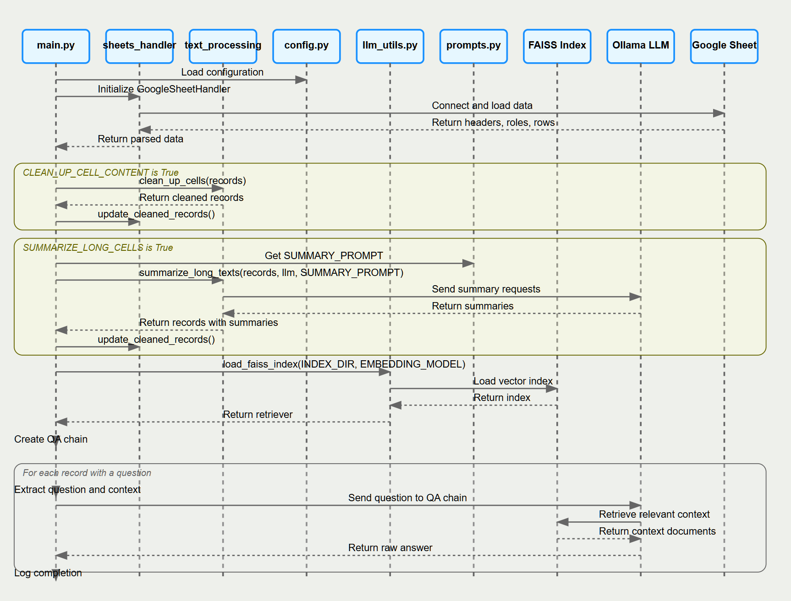

# RAG Processing System

A Retrieval-Augmented Generation system for answering questions about Salesforce products with compliance ratings.

## Overview

This system processes questions from a Google Sheet, uses a FAISS vector database to retrieve relevant context, and generates structured answers using a Language Model. The answers include both explanatory text and a compliance rating that indicates how well Salesforce products meet the requirements.

## Features

- **Google Sheets Integration**: Input/output with robust error handling
- **Text Processing**: Cleaning, normalization, and JSON response formatting
- **Vector Search**: FAISS index with product-specific knowledge
- **LLM Integration**: Multiple provider support (Ollama, llama.cpp)
- **Compliance Rating**: Assignment (FC, PC, NC, NA) with optimistic fallback
- **Reference Extraction**: URL extraction and formatting
- **Question Filtering**: Advanced relevance filtering for out-of-scope questions
- **Custom Context**: Customer-specific document indices for tailored responses
- **Batch Processing**: API throttling for efficiency
- **Knowledge Aggregation**: Refined processing across multiple documents

## Architecture Diagrams

### Flow Diagram


This diagram shows the major components of the RFP module and how they interact.

### Sequence Diagram


This sequence diagram illustrates the typical flow of an RFP operation from initialization to completion.

## Requirements

- Python 3.8+
- Google API credentials (JSON file)
- FAISS index with Salesforce documentation
- LLM server (Ollama or llama.cpp)

## Installation

1. Clone the repository:
```bash
git clone https://github.com/jkoenig72/llmrag.git
cd llmrag
```

2. Install dependencies:
```bash
pip install -r requirements.txt
```

3. Set up environment variables or create a `.env` file:
```bash
# Google Sheets Configuration
GOOGLE_SHEET_ID="your-sheet-id"
GOOGLE_CREDENTIALS_FILE="path/to/credentials.json"

# Directory Configuration
BASE_DIR="~/RAG"
INDEX_DIR="~/faiss_index_sf"
RFP_DOCUMENTS_DIR="~/RFP_Documents"
CUSTOMER_INDEX_DIR="~/customer_indices"

# LLM Configuration
LLM_PROVIDER="llamacpp"  # "ollama" or "llamacpp"
LLM_MODEL="mistral-small3.1"
OLLAMA_BASE_URL="http://localhost:11434"
LLAMA_CPP_BASE_URL="http://localhost:8080"
EMBEDDING_MODEL="intfloat/e5-large-v2"

# Processing Configuration
SKIP_INDEXING="True"
BATCH_SIZE="5"
API_THROTTLE_DELAY="3"
RETRIEVER_K_DOCUMENTS="3"
CUSTOMER_RETRIEVER_K_DOCUMENTS="3"
```

## Usage

### Getting Started

1. Prepare a Google Sheet with the following format:
   - **First row:** Headers (e.g., "No.", "Question", "Primary Product", "Answer", etc.)
   - **Second row:** Include `#answerforge#` in column A, and define roles:
     - `question` - Column where questions are stored
     - `context` - Column for additional context (optional)
     - `primary_product` - Column for product focus (optional)
     - `answer` - Column where answers will be written
     - `compliance` - Column for compliance ratings
     - `references` - Column for reference URLs (optional)

2. Start your LLM server:
   - For llama.cpp: `./llama-server --model /path/to/model.gguf --ctx-size 4096 --port 8080`
   - For Ollama: Ensure Ollama is running with your model available

3. Run the main script:
   ```bash
   python main.py
   ```

4. Follow the interactive prompts to:
   - Select product focus
   - Choose customer context folder (if available)
   - Select starting row number

## Project Structure

```
rfp/
├── main.py                 # Main orchestration script
├── config.py               # Configuration parameters
├── llm_utils.py            # Utilities for LLM and FAISS
├── llm_wrapper.py          # LLM provider initialization
├── prompts.py              # Prompt templates
├── sheets_handler.py       # Google Sheets integration
├── text_processing.py      # Text cleaning and summarization
├── question_processor.py   # Question processing logic
├── product_selector.py     # Product selection and user interaction
├── customer_docs.py        # Customer document handling
├── question_logger.py      # Detailed question logging
└── requirements.txt        # Required Python packages
```

## Processing Flow

1. **Question retrieval:** Questions are loaded from the Google Sheet
2. **Document retrieval:** 
   - Product documents from the main FAISS index
   - Optional customer documents from customer index if selected
3. **Refine chain processing:**
   - Initial answer generated from first document(s)
   - Each additional document refines the answer
   - Multiple LLM calls create increasingly comprehensive responses
4. **Answer extraction:** Structured JSON responses are parsed
5. **Google Sheet update:** Answers, compliance ratings, and references written back

## Compliance Ratings

- **FC** (Fully Compliant): Supported via standard configuration or UI-based setup
- **PC** (Partially Compliant): Requires custom development (Apex, LWC, APIs)
- **NC** (Not Compliant): Not possible in Salesforce even with customization
- **NA** (Not Applicable): Question is out of scope for Salesforce

## Customer-Specific Context

The system supports loading customer-specific documents to provide tailored responses:

1. Create a folder with the customer name in the `RFP_DOCUMENTS_DIR` directory
2. Add PDF or DOCX files with customer-specific information
3. When running the system, select the customer folder when prompted
4. The system will create or use an existing index for those documents

## Configuration Options

| Setting | Description | Default |
|---------|-------------|---------|
| SKIP_INDEXING | Skip creating index and use existing one | True |
| CLEAN_UP_CELL_CONTENT | Apply text cleaning to cells | False |
| SUMMARIZE_LONG_CELLS | Summarize texts longer than the word limit | False |
| MAX_WORDS_BEFORE_SUMMARY | Word limit before summarization | 200 |
| BATCH_SIZE | Number of updates to batch together | 5 |
| API_THROTTLE_DELAY | Seconds to wait between API calls | 3 |
| RETRIEVER_K_DOCUMENTS | Number of documents to retrieve from FAISS | 3 |
| CUSTOMER_RETRIEVER_K_DOCUMENTS | Number of customer documents to retrieve | 3 |

## Troubleshooting

### Common Issues

1. **FAISS index not found**: Ensure INDEX_DIR points to a valid FAISS index directory
2. **Google Sheets API errors**: Verify credentials and permissions
3. **LLM connection errors**: Confirm your LLM server is running at the right address and port
4. **Empty answers**: Check the question log file to see the raw LLM response
5. **Missing some input keys error**: Ensure your prompt templates don't reference missing variables

### Logging

Logs are written to both the console and a log file at `{BASE_DIR}/rag_processing.log`. Detailed question processing logs are stored in `{BASE_DIR}/question_logs/`.

## Example Output

```
✅ Row 3 complete
Question: In your Order Management module, do you support the concept of a Point of no return PONR?
Product Focus: Communications Cloud

Answer:
Yes, we support the concept of a Point of No Return (PONR) in our Order Management module within 
Communications Cloud. You can configure PONR at the order or item level, preventing further modifications 
once an order or item reaches a specific status.

Compliance: FC

References (1):
• https://help.salesforce.com/s/articleView?id=ind.comms_t_rules_for_how_point_of_no_returnponrpropagates_through_a_decompositionplan_234475.htm&language=en_US&type=5
```
<<<<<<< HEAD
=======

**License and Contributions**

Maintained by Master Control Program. Contributions and feedback are welcome — please submit pull requests or open issues on GitHub.
>>>>>>> 8f29b56 (Update)
